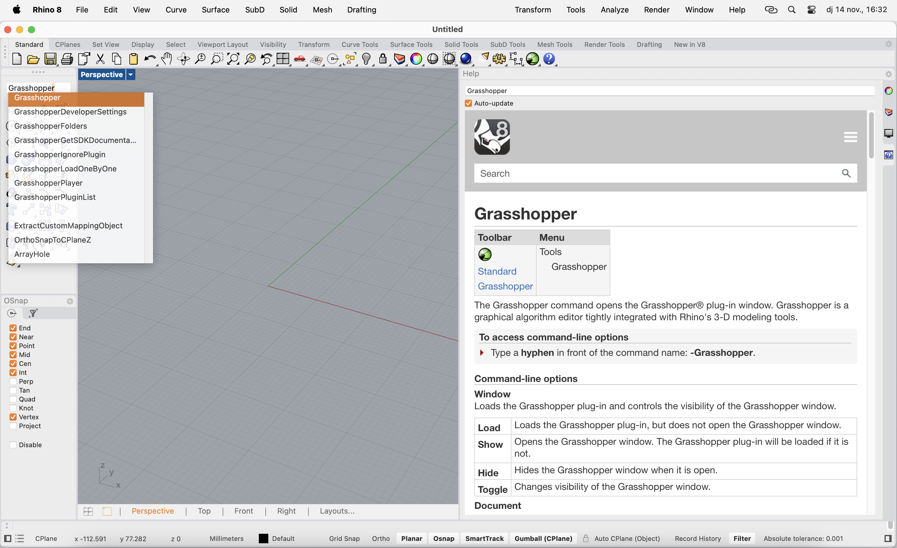

# AI Tools Plug-In

Plug-In developed by [**Jorge Muñoz Zanón**](https://www.linkedin.com/in/jorgemunozzanon/) 

<!--[**VIDEO**](https://youtu.be/unV0LstCBbw?si=zaSHL5S3cfa8WwwG)-->


<div align="center">
  <a href="https://youtu.be/unV0LstCBbw?si=zaSHL5S3cfa8WwwG">
    
  </a>
</div>


## The project

With my goal of trying to democratize design and manufacturing processes I developed this plug-in allowing users to apply AI modeling tools in their grasshopper/design workflows. In this first version the plug-in has two components. On one side a text-to-CAD component that allows users to generate objects based on a text prompt using [ZOO's]( https://zoo.dev/) text-to-CAD model. On the other hand I developed another component called Image-to-Prompt. This component will generate a detailed step by step prompt based on an image stored locally on your computer. Feeding this text to the previously mentioned text-to-CAD component will generate this model. This second component has been developed using [OpenAI's](https://openai.com/api/) vision tool. 

## What do I need to be able use it?

To be able to use AI Tools you will need:

1. [Rhino3D](https://www.rhino3d.com/) installed on your computer (The plug-in has been developed on Rhino8 for Mac so I don't know if it works properly on older versions of Rhino as it's based on Python3, not IronPython or if it works on Windows. Hope that if you are in this situation you let me know your experience with it so I can try to make it work in those systems)

2. [ZOO](https://zoo.dev) API keys, to have access to the model. Register (You can do it with GitHub) and add money to your wallet. From experience the requests don't spend a lot of money.

3. [OpenAI API](https://openai.com/api/) keys. Register on OpenAI go to your profile/billing and add money to the wallet ***IMPORTANT: Even if you pay for GPT Plus you will need to pay for tokens, is not the same.**

4. ```AI_Tools.Components.gha``` file you will find in this repo. Or [Food4Rhino](https://www.food4rhino.com/en/app/ai-tools?lang=en)

5. Optionally you can have a look at the example files available in this repository to play around and see how to set up.

## I think the code is not well optimized / I think some things should or could be changed. Is it possible to modify the code?

For sure!!!! This is an open source project. As my background has never been coding I managed to do my best with my skills in order to make this idea a plug-in but as I know I'm not that good at coding I decided to make it completely open so anyone of you can get the code, modify it or add any new component you can think of. I'm always open to have a chat!

## How to install it?

The main file to make it work on your Rhino/Grasshopper is the ```.gha``` file under ```build/rh8/AI_Tools.Components.gha```
This file can also be downloaded from [Food4Rhino](https://www.food4rhino.com/en/app/ai-tools?lang=en) just clicking download.


With this file you should:


1. Open Rhino on your computer.


2. Type Grasshopper on the command line or click on the icon




3. Under grasshopper go into ```File/Special Folders/Components Folder``` 


4. Drag and drop the component there.


5. Quit Rhino and restart

## How to make it work?

Once installed on the restart when you open grasshopper again you'll see a new label on top called AI Tools, when you click on that it should look something like this:


### Text-to-CAD

Let's start with the first component drag and drop Text-to-CAD to the canvas.


This component has 4 inputs:

- **API key:** Here you will connect a ```Panel``` with your ZOO API key.


- **Directory:** Here you will connect a ```File Path``` component with a directory. This is just a temporary directory to save the file generated before importing. After being imported it will be deleted. 


- **Prompt:** Here you will add your text asking what you want the model to generate. In my case 'Design a LEGO module'. Here's some inputs that might help you create a good prompt taken from [ZOO's]( https://zoo.dev/) website:
  - Describe an object that can be represented in geometric shapes, not nebulous concepts such as "a tiger" or "the universe", unless you're just curious what it does with that 😏
  - Be as explicit as possible. For example, if you want a plate with 4 holes, say *where* you want the holes placed and *how big* of a diameter each should have
  - Our ML models are better at describing single objects than assemblies *for now*
  - The maximum prompt length is a few thousand words. Longer prompts usually take longer to respond.
  - Shorter prompts, 1-2 sentences in length, succeed more often than longer prompts.
  - If your prompt omits important dimensions, Text-to-CAD will make its best guess to fill in missing details.
  - Traditional, simple mechanical parts work best right now - fasteners, bearings, connectors, etc.


- **Activate:** This will require a ```Boolean Toggle``` either a ***True*** or ***False*** value to activate or not


Once the Toggle get's turned to ***True*** the model will get generated in your rhino window.


### Image-to-Prompt


This is a simpler component with only two inputs. 

- **x:** This is were you will add your OpenAI API key in a ```Panel``` component.


- **y:** Here you will add a ```File Path``` once again but selecting one existing file (the image you want to describe)


When everything is connected, output ``` a``` will generate a text of a detailed description to generate the model to use it as a prompt for the ```Text-to-CAD``` component. The file I selected for this example is the following:


Conected to the previous component we get the following:


## Troubleshooting

Interesting aspects to take into account if any of the components fail:

- Make sure you are using a valid API key with enough money behind it
- Make sure you're connected to the internet
- Text-to-CAD returns a 500 error code if it fails to generate a valid geometry internally, even if it understands your prompt.
- The same prompt can generate different results when submitted multiple times. Sometimes a failing prompt will succeed on the next attempt, and vice versa.

## What's next?

As mentioned before, this is an open source project so it's completely open for anyone to take the scripts ```Text_to_CAD.py``` or ```Image-to-Prompt.py``` set it up on your GH and modify it. Also if anyone has ideas of new components or wants to do them feel free to hit me up so they can be developed and added here to make a collaborative plug-in. 

Also, ```Test_File_AI_Tools.gh``` is a perfect example of how to set up the scripts and has a simple application of how the tool can be used. 


Some ideas I've been having for future versions of the plug-in. If you want to add a specific tool for your workflow please tell me and I can add it to the list.

- [ ] Iteration process
- [ ] Change prompt generation from vision tool
- [ ] Piece modification????


[](https://app.repohistory.com/star-history)